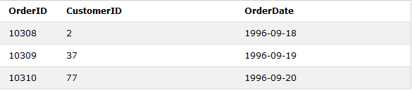
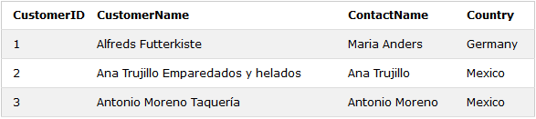
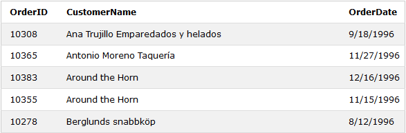

# Apuntes de SQL para Bases de Datos
## Índice
- [Detalles importantes](#detalles-importantes)
- [Clausulas](#clausulas)
  - [SELECT](#select)
  - [FROM](#from)
  - [WHERE](#where)
    - [Operadores de WHERE](#operadores-de-where)
  - [ORDER BY](#order-by)
  - [GROUP BY](#group-by)
  - [JOIN](#join)


## Detalles importantes
1. Los strings van siempre entre comillas simples.
2. La \ sirve para dejar un espacio en blanco.
3. Para poner mayor o menor + igual, él = deve de ir despues de < o >.
4. Para indicar que algo es diferente utilizaremos **<>**.
5. Siempre terminaremos una consulta con **;** punto y coma.
6. Para hacer comentarios en una linea usaremos **--** antes del comentario.
7. Para hacer los comentarios en varias lineas usaremos **/* */** poniendo el comentario entre los asteriscos.
8. Las clausulas SELECT, FROM, WERE, HAVING ... iran siempre en mayúsculas.

## Clausulas

### SELECT
La instrucción SELECT se utiliza para seleccionar datos de una base de datos.
```SQL
SELECT column1, column2, ...
FROM table_name;
```
Aquí, columna 1, columna2, ... son los nombres de los campos que utilizamos para selecionar los datos que queremos mostrar.
### FROM
La intruccion FROM se utiliza para indicar en que tabla o tablas se encuentran los atributos que selecionamos con en SELECT.
```SQL
SELECT column1, column2, ...
FROM table_name;
```
Aquí, table_name es el nombre de la tabla en la que se encuentra la columnas column1, column2.
### WHERE
La cláusula WHERE se usa para filtrar registros.
```SQL
SELECT *
FROM Customers
WHERE Country='Mexico';
```
En esta instrucción SQL selecciona a todos los clientes del país "México", en la tabla "Customers".
#### Operadores de WHERE
- El operador **IN** es una abreviatura para múltiples condiciones OR.  
La siguiente instrucción SQL selecciona a todos los clientes que se encuentran en "Germany", "France" o "UK":
```SQL
SELECT *
FROM Customers
WHERE Country IN ('Germany', 'France', 'UK');
```

- El operador **LIKE** se usa para buscar un patrón específico en una columna.  
Hay dos comodines que se usan con frecuencia junto con el operador LIKE:
  - %: El signo de porcentaje representa cero, uno o varios caracteres.
  - _ - El guión bajo representa un solo carácter.

  La siguiente instrucción SQL selecciona a todos los clientes con un CustomerName que comienza con "a":
```SQL
  SELECT *
  FROM Customers
  WHERE CustomerName LIKE 'a%';
  ```
- El operador **BETWEEN** selecciona valores dentro de un rango dado. Los valores pueden ser números, texto o fechas.   
La siguiente instrucción SQL selecciona todos los productos con un precio BETWEEN  10 y 20:
```SQL
SELECT *
FROM Products
WHERE Price BETWEEN 10 AND 20;
```
- Los operadores **<, >, = o <>(diferente)** se utilzan para comparar datos de las tablas.
En la siguiente insturcción filtramos para que solo aparezacan los paises con más de 200000000 habitantes.
```sql
SELECT nombre
FROM world
WHERE population > 200000000;
```
- Los operadores **AND** y **OR**0se utilizan para filtrar registros en función de más de una condición:
  - El operador **AND** muestra un registro si todas las condiciones separadas por AND son verdaderas.    
  La siguiente instrucción SQL selecciona todos los campos de "Clientes" donde el país es "Alemania" Y la ciudad es "Berlín":
  ```sql
  SELECT *
  FROM Customers
  WHERE Country='Germany' AND City='Berlin';
  ```
  - El operador **OR** muestra un registro si alguna de las condiciones separadas por OR es verdadera.  
  La siguiente instrucción SQL selecciona todos los campos de "Clientes" donde la ciudad es "Berlín" O "München":
  ```sql
  SELECT *
  FROM Customers
  WHERE City='Berlin' OR City='München';
  ```
- El operador **NOT** muestra un registro si la (s) condición (es) NO ES verdadera.   
La siguiente instrucción SQL selecciona todos los campos de "Clientes" donde el país NO es "Alemania":
```sql
SELECT *
FROM Customers
WHERE NOT Country='Germany';
```
### ORDER BY
La palabra clave ORDER BY ordena los registros en orden ascendente de forma predeterminada. Para ordenar los registros en orden descendente, use la palabra clave DESC.   
La siguiente instrucción SQL selecciona a todos los clientes de la tabla "Clientes", ordenados por la columna "País":
```sql
SELECT *
FROM Customers
ORDER BY Country;
```
### GROUP BY
La instrucción GROUP BY agrupa filas que tienen los mismos valores en filas de resumen, como "buscar el número de clientes en cada país".
La instrucción GROUP BY a menudo se usa con funciones agregadas (COUNT, MAX, MIN, SUM, AVG) para agrupar el conjunto de resultados por una o más columnas.  
La siguiente instrucción SQL enumera el número de clientes en cada país:
```SQL
SELECT COUNT(CustomerID), Country
FROM Customers
GROUP BY Country;
```
### JOIN
Una cláusula JOIN se usa para combinar filas de dos o más tablas, en función de una columna relacionada entre ellas.    
Veamos una selección de la tabla "Pedidos":   
    
Luego, mire una selección de la tabla "Clientes":
      
   Observe que la columna "CustomerID" en la tabla "Pedidos" se refiere al "CustomerID" en la tabla "Clientes". La relación entre las dos tablas anteriores es la columna "CustomerID".   
   Luego, podemos crear la siguiente instrucción SQL (que contiene una UNIÓN INTERNA), que selecciona registros que tienen valores coincidentes en ambas tablas:
```SQL
SELECT Orders.OrderID, Customers.CustomerName, Orders.OrderDate
FROM Orders
INNER JOIN Customers ON Orders.CustomerID=Customers.CustomerID;
```
y producirá algo como esto:   

## INER JOIN
La palabra clave **INNER JOIN** selecciona registros que tienen valores que coinciden en ambas tablas.    
La siguiente instrucción SQL selecciona todos los pedidos con información del cliente:
```SQL
SELECT Orders.OrderID, Customers.CustomerName
FROM Orders
INNER JOIN Customers ON Orders.CustomerID = Customers.CustomerID;
```   

**Nota:** La palabra clave INNER JOIN selecciona todas las filas de ambas tablas siempre que haya una coincidencia entre las columnas. Si hay registros en la tabla "Pedidos" que no tienen coincidencias en "Clientes", ¡estos pedidos no se mostrarán!

## LEFT JOIN
La palabra clave **LEFT JOIN** devuelve todos los registros de la tabla izquierda (tabla1) y los registros coincidentes de la tabla derecha (tabla2). El resultado es NULL desde el lado derecho, si no hay coincidencia.   
La siguiente instrucción SQL seleccionará a todos los clientes y cualquier pedido que puedan tener:
```SQL
SELECT Customers.CustomerName, Orders.OrderID
FROM Customers
LEFT JOIN Orders ON Customers.CustomerID = Orders.CustomerID
ORDER BY Customers.CustomerName;
```   

**Nota:** La palabra clave LEFT JOIN devuelve todos los registros de la tabla izquierda (Clientes), incluso si no hay coincidencias en la tabla derecha (Pedidos).
## RIGHT
La palabra clave **RIGHT JOIN** devuelve todos los registros de la tabla derecha (tabla2) y los registros coincidentes de la tabla izquierda (tabla1). El resultado es NULL desde el lado izquierdo, cuando no hay coincidencia.    
The following SQL statement will return all employees, and any orders they might have placed:
```SQL
SELECT Orders.OrderID, Employees.LastName, Employees.FirstName
FROM Orders
RIGHT JOIN Employees ON Orders.EmployeeID = Employees.EmployeeID
ORDER BY Orders.OrderID;
```

**Nota:** La palabra clave RIGHT JOIN devuelve todos los registros de la tabla derecha (Empleados), incluso si no hay coincidencias en la tabla izquierda (Pedidos).
